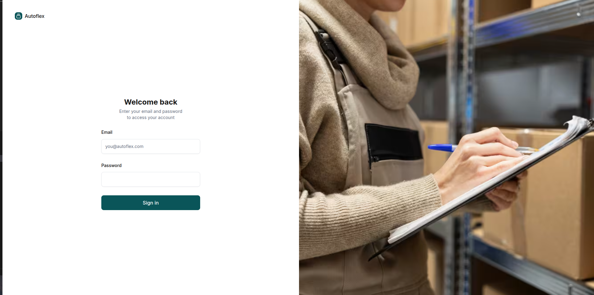
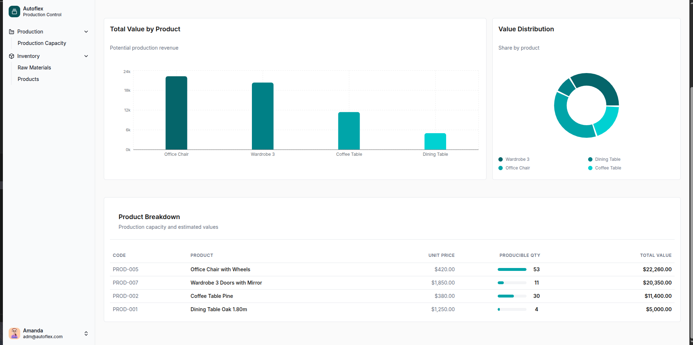
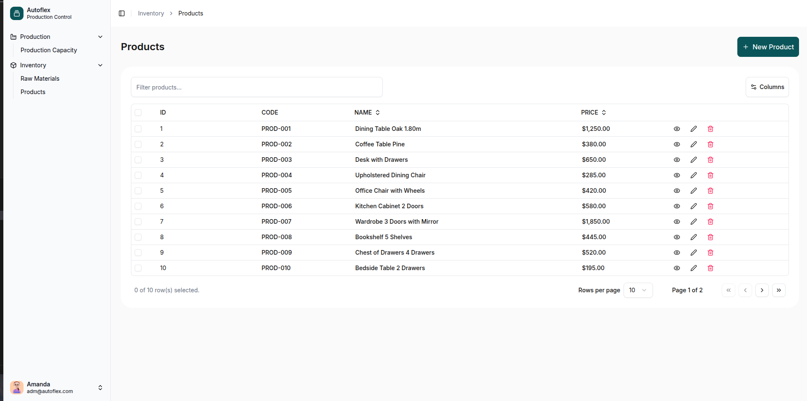
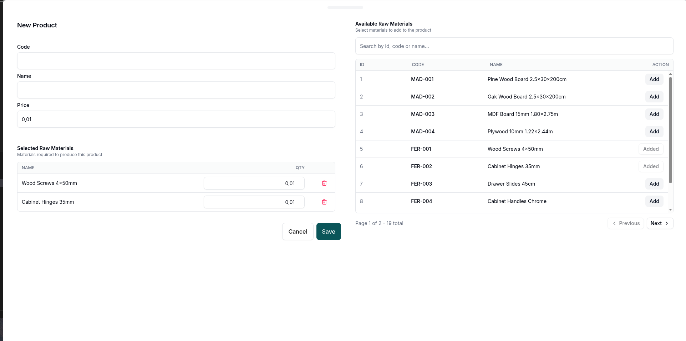
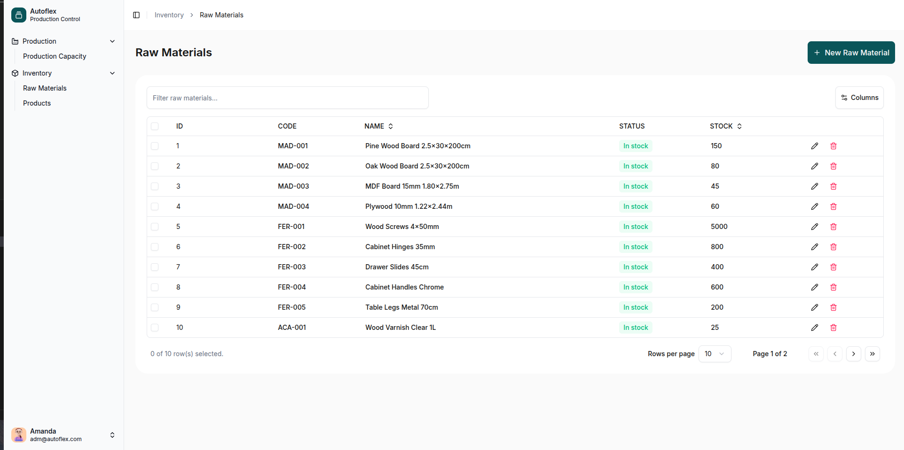

# Autoflex Production Control - Frontend

Aplicação web para gestão de produção e estoque, construída com Next.js. O sistema permite autenticação de usuários, cadastro de produtos e matérias-primas, associação de insumos aos produtos e visualização da capacidade de produção com base no estoque disponível.

## Visão Geral

O frontend consome uma API backend para realizar operações de cadastro e consulta. A interface foi desenvolvida com foco em usabilidade, responsividade e organização por módulos.

## Funcionalidades

- Login de usuário e controle de sessão.
- Dashboard de capacidade de produção com indicadores e gráficos.
- CRUD de produtos.
- CRUD de matérias-primas.
- Associação de matérias-primas aos produtos.
- Pesquisa e paginação nas listas.
- Fluxo de logout.
- Tratamento de estados de carregamento e páginas não encontradas.

## Stack

- Next.js 16 (App Router)
- React 19
- TypeScript
- Redux Toolkit + React Redux
- Shadcn UI + Radix + Tailwind CSS
- React Hook Form + Zod
- Cypress (testes de componente e E2E)

## Estrutura Principal

- `app/`: rotas e páginas da aplicação.
- `components/`: componentes reutilizáveis e seções de tela.
- `lib/store/`: configuração do Redux, slices e thunks.
- `services/`: integração com API.
- `schemas/`: validações com Zod.
- `cypress/`: testes E2E, component tests, suporte e mocks.

## Pré-requisitos

- Node.js 20+
- pnpm (recomendado)
- Backend da aplicação em execução

## Configuração de Ambiente

1. Copie o arquivo de exemplo:

```bash
cp env-example .env
```

2. Ajuste a variável:

```env
API_URL=http://localhost:8080
```

## Como Executar

Instalar dependências:

```bash
pnpm install
```

Rodar em desenvolvimento:

```bash
pnpm dev
```

Aplicação disponível em `http://localhost:3000`.

## Build de Produção

```bash
pnpm build
pnpm start
```

## Lint

```bash
pnpm lint
```

## Testes

Este projeto usa Cypress para dois tipos de teste.

### Testes de Componente

Modo interativo:

```bash
npx cypress open --component
```

Execução em modo headless:

```bash
npx cypress run --component
```

### Testes E2E

Modo interativo:

```bash
npx cypress open --e2e
```

Execução em modo headless:

```bash
npx cypress run --e2e
```

Observação: para os testes E2E, mantenha frontend e backend ativos.

## Rotas da Aplicação

- `/login`: autenticação
- `/`: dashboard de capacidade de produção
- `/products`: gestão de produtos
- `/raw-materials`: gestão de matérias-primas

## Credenciais para ambiente local

Se o backend estiver com dados de seed padrão:

- Email: `adm@autoflex.com`
- Senha: `adm`

## Screenshots

### Login


### Production Capacity


### Production Breakdown


### Products


### New Product with Association


### Raw Materials


## Deploy

Há configuração de pipeline via `amplify.yml` para deploy em ambiente cloud.
